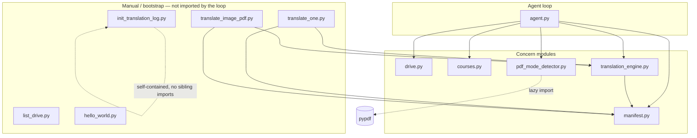

# ARCHITECTURE

Full architecture scan, grounded in the actual source (not STATUS/HISTORY/plan).
Where docs and code disagree, the code is authoritative and the gap is flagged in
§8. **Read-only pass — nothing was changed.**

Scope: the 11 project `.py` files (all git-tracked; no untracked `.py` exist),
plus the routing prompt, the four skills, `courses.json`, and the live
`translated_log.json`. The `.venv/` tree is excluded.

---

## 1. Module map

Internal package (no `__init__.py`; flat module imports). "Imports (sibling)" lists
only project-local imports, not stdlib/third-party.

### `agent.py` — the agent loop + the 7 tool schemas + their handlers
The only orchestrator. Defines `TOOLS` (7 schemas), the per-tool handlers, the
in-memory `CONTENT_CACHE`, prompt-cache plumbing, and the `__main__` loop.
- **Imports (sibling):** `courses`, `drive`, `manifest`, `translation_engine as engine`, `from pdf_mode_detector import detect_pdf_mode`
- Module-level: `client = Anthropic()`, `ROOT_FOLDER_ID` (hard-coded Drive id), `SYSTEM_PROMPT = Path("agent_routing_prompt.md").read_text(...)`, `TOOLS`, `CONTENT_CACHE = {}`, `HANDLERS`, `SYSTEM_CACHED`.
- **Functions:**
  - `handle_list_folder(inp) -> str` — JSON-dumps `drive.list_folder_children`.
  - `read_file_logic(file_id) -> dict` — download→md5-gate→hash→dedup→detect; never raises into the loop (failures become `{"status":"error"}`).
  - `handle_read_file(inp) -> str` — JSON wrapper over `read_file_logic`.
  - `handle_fetch_signal_detail(inp) -> str` — returns offloaded `per_page`+`unrecognized_sample` by handle from `CONTENT_CACHE`.
  - `_translate_logic(inp, engine_fn) -> dict` — shared core for both translate tools; reads cached bytes, runs the engine, caches markdown+cost, returns metadata only.
  - `handle_translate_text(inp) -> str` / `handle_translate_image(inp) -> str` — JSON wrappers binding `_translate_logic` to `engine.translate_text_pdf` / `engine.translate_image_pdf`.
  - `handle_save_to_vault(inp) -> str` — reads md/cost/signals/md5 from cache, delegates to `engine.save_to_vault`.
  - `handle_update_mapping(inp) -> str` — delegates to `courses.update_mapping`; prints a loud `AUTO-NAMED:` audit line.
  - `_set_cache_breakpoint(messages) -> None` — moves the conversation-prefix `cache_control` marker onto the last message's last block.
  - `__main__` block — builds kickoff, opens run log, runs the budget-guarded loop, prints crash-safe summary.
- **Dead/quirky code:** Lines 1–2 are a stale top-of-file comment naming files that don't exist (`stage1_bare_turn.py`, `stage2_loop.py`). The handler docstrings (lines 121–122) still say "the rest are still stubbed" — **untrue**; every handler is real. `handle_update_mapping` prints `AUTO-NAMED:` (line 395) **and** the loop re-derives and logs the same event at lines 593–597 → the auto-name is announced twice (one to stdout, one to the run-log accumulator).

### `translation_engine.py` — core translation + vault executor (no loop, no tools)
Stateless functions shared by the agent and the manual wrappers.
- **Imports (sibling):** `manifest`
- Module-level: `MODEL = "claude-opus-4-8"`, `DPI = 200`, skill files loaded **once at import** (`_TRANSLATION_PROMPT`, `_TEXT_SKILL`, `_IMAGE_SKILL`, composed into `_TEXT_SYSTEM_PROMPT`/`_IMAGE_SYSTEM_PROMPT`), `_ROUTING_PROMPT` (loaded but **unused here** — dead read), `_TYPE_KEYWORDS`, `TYPE_TO_FOLDER`.
- **Functions:**
  - `sha256_of(data: bytes) -> str` — `"sha256:" + hexdigest`. (Duplicate of `manifest.sha256_of`.)
  - `infer_type(filename: str) -> str | None` — keyword→type; **only the manual wrappers call it** (the agent passes `file_type` explicitly).
  - `vault_output_path(vault_path, course_english, type_value, drive_filename, custom_subfolder=None) -> Path` — pure path build; raises `ValueError` on unknown type with no `custom_subfolder`.
  - `_pil_to_base64_png(image) -> str`
  - `_calc_cost(usage) -> float` — `(in*5 + out*25)/1e6` (Opus 4.8 rates, hard-coded).
  - `translate_text_pdf(pdf_bytes, course_english, drive_file_id, drive_filename, source_hash, today_date) -> dict` — pypdf extract; raises `RuntimeError` if `<50` chars; Claude text call; returns `{markdown,input_tokens,output_tokens,cost_usd,model,mode="text"}`.
  - `translate_image_pdf(...same sig...) -> dict` — pdf2image rasterise @200 DPI; Claude vision call; `mode="image"`.
  - `save_to_vault(course_english, type_value, markdown, drive_file_id, drive_filename, source_hash, cost_data, chosen_mode, mode_reasoning, vault_path, detection_signals=None, source_md5=None, custom_subfolder=None) -> dict` — atomic `.md` write **then** manifest upsert; returns `{"status":"saved","md_path":...}`.
- **Note:** `drive_file_id` is a declared parameter of both `translate_*` functions but is **unused** inside them (agent passes `""`).

### `manifest.py` — sole owner of `translated_log.json` I/O
- **Imports (sibling):** none.
- `sha256_of(data) -> str`; `load_log() -> list[dict]`; `save_log(entries) -> None` (atomic via `.tmp`+`os.replace`); `find_by_id(entries, drive_file_id) -> dict|None`; `upsert_entry(entries, entry) -> list[dict]` (in-place replace by `drive_file_id`, else append).
- Note `LOG_PATH` uses `.with_suffix(".tmp")` so the temp file is `translated_log.tmp`.

### `drive.py` — all Google Drive I/O for the agent loop
- **Imports (sibling):** none. Builds `service` **once at import** (auths on import → side effect on `import drive`).
- `get_credentials()`; `download_bytes(file_id) -> bytes` (size-verified, re-downloads on short read, raises `IOError` if never complete); `file_md5(file_id) -> str|None` (metadata-only, `None` for native Google files); `list_folder_children(folder_id) -> list[dict]` (paginated, non-recursive, `{name,id,type,mime_type}`).

### `courses.py` — sole owner of `courses.json` I/O
- **Imports (sibling):** none.
- `load_courses() -> dict` (flat `{hebrew: english}`); `update_mapping(hebrew_name, english_name) -> dict` (atomic `.tmp`+`os.replace`, returns `{"hebrew_name","english_name"}`).

### `pdf_mode_detector.py` — pure extraction-signal reporter (NO verdict)
- **Imports (sibling):** none. `pypdf` imported lazily inside `detect_pdf_mode`.
- `_is_math_token(token) -> bool`; `_is_recognizable(token) -> bool`; `_analyze_text(text) -> dict`; `detect_pdf_mode(pdf_bytes) -> dict`.
- Module constants `_RECOGNIZABILITY_THRESHOLD`, `_MAX_GARBAGE_RUN_THRESHOLD`, `_MIN_TEXT_CHARS` are **deliberately dead** — old verdict cutoffs kept for reference, applied nowhere.
- `__main__` is a self-contained unit-test harness (`_check`, `_check_tok`).

### Manual / bootstrap scripts (not part of the agent loop)
- **`translate_one.py`** — manual single-file **text-mode** translation. Has `DRIVE_FILE_ID`/`COURSE_HEBREW` to fill in. **Imports (sibling):** `from manifest import load_log, save_log`, `from translation_engine import infer_type, sha256_of, translate_text_pdf`. Carries its **own** copies of `get_drive_credentials`/`download_bytes` (duplicates `drive.py`). Writes the manifest **directly** (remove-then-append, not `manifest.upsert_entry`) and writes the `.md` **directly to the course root** (no type subfolder) — a different path model than the agent's.
- **`translate_image_pdf.py`** — manual single-file **image-mode** twin of the above; same duplication. Its `DRIVE_FILE_ID` (`...JQNjuP`) is one char longer than `translate_one.py`'s (`...JQNju`) — likely a copy-paste artifact. Does its own hash-dedup against the log before translating.
- **`list_drive.py`** — standalone folder lister (prints name+id). Builds its own creds/service. Not imported anywhere.
- **`hello_world.py`** — smoke test; one Sonnet 4.6 call. Not imported anywhere. Last touched 2026-04-20 (oldest file).
- **`init_translation_log.py`** (549 LOC) — one-shot bootstrap: walks Drive + vault, fuzzy-matches existing `.md` to Drive PDFs, rewrites frontmatter, and seeds `translated_log.json` with `manual` / `not_translated_yet` / `skipped_permanent` entries. **Imports (sibling):** none (self-contained; predates `manifest.py`). Interactive (`prompt_type`, `_prompt_skip_reason`). Not imported by any module. Source of the legacy manifest shapes (see §5).

---

## 2. Tool layer

Schemas live in `agent.py:TOOLS` (lines 25–119). Dispatch table `HANDLERS` (lines
399–407). The architecture is **thin wrapper in `agent.py` → fn-by-concern in a
sibling module**, and it holds for every tool. Confirmed split.

| Schema name | Input params (required ✚ / optional) | Handler (`agent.py`) | Underlying fn (module) |
|---|---|---|---|
| `list_folder` | ✚`folder_id` | `handle_list_folder` | `drive.list_folder_children` |
| `read_file` | ✚`file_id` | `handle_read_file` → `read_file_logic` | `drive.file_md5`, `drive.download_bytes`, `manifest.load_log/find_by_id`, `manifest.sha256_of`, `pdf_mode_detector.detect_pdf_mode` |
| `fetch_signal_detail` | ✚`handle` | `handle_fetch_signal_detail` | reads `CONTENT_CACHE` (no module fn) |
| `translate_text_pdf` | ✚`source_hash`,`course`,`drive_filename`,`mode_reasoning` | `handle_translate_text` → `_translate_logic` | `engine.translate_text_pdf` |
| `translate_image_pdf` | ✚`source_hash`,`course`,`drive_filename`,`mode_reasoning` | `handle_translate_image` → `_translate_logic` | `engine.translate_image_pdf` |
| `save_to_vault` | ✚`course`,`filename`,`source_hash`,`md_cache_handle`,`drive_file_id`,`drive_filename`,`chosen_mode`,`mode_reasoning`; opt `file_type`(enum lecture/tutorial/homework/exam),`custom_subfolder` | `handle_save_to_vault` | `engine.save_to_vault` → `vault_output_path`, `manifest.load_log/upsert_entry/save_log` |
| `update_mapping` | ✚`hebrew_name`,`english_name` | `handle_update_mapping` | `courses.update_mapping` |

"The 6 loop tools + `fetch_signal_detail`" = 7 total; that matches `TOOLS`.

**Schema-vs-handler mismatch (flag):** the `save_to_vault` schema requires
`filename`, but `handle_save_to_vault` **never reads `inp["filename"]`** — the
output stem is derived from `drive_filename` inside `vault_output_path`
(`Path(drive_filename).stem`). `filename` is a required-but-ignored field.

---

## 3. Agent loop (`agent.py` `__main__`, lines 451–659)

**Message-history construction.** `messages` starts as a single `user` kickoff
string (line 500). On each `tool_use` turn the assistant `response.content` is
appended **verbatim** as one `assistant` message (must keep the `tool_use`
blocks), then all tool results are appended as **one** `user` message whose
`content` is the list of `tool_result` blocks (lines 558, 611–618).

**Kickoff (lines 489–499) + `courses.json` injection.** `COURSES =
courses.load_courses()` → rendered as a `mappings_block` of `- hebrew → english`
lines → embedded into the kickoff under a `## Approved course mappings (from
courses.json)` heading, with explicit instructions: matched folder → use approved
name; unmatched folder → auto-name, persist via `update_mapping`, log it, don't
skip. The block is also printed and written to the run log.

**stop_reason handling (lines 551–620).**
- `end_turn` → print/log "RUN COMPLETE", `break`.
- `tool_use` → append assistant turn, run each `tool_use` block, append results, loop.
- Any other stop_reason → falls through (no append) and the `while True` re-issues `create()` with unchanged `messages` (no explicit handling for `max_tokens`/`pause_turn`).

**Tool dispatch (lines 562–615).** For each `tool_use` block: budget check first,
increment counter, look up `HANDLERS[block.name]` (no `KeyError` guard — an unknown
tool name would raise into the outer `except`), call handler, parse result for
audit events (`update_mapping`→`mapped`, `saved`, `refused`, and any `cost_data`).
`list_folder` returns a JSON **array**, so results are `json.loads`'d defensively
and non-dict results coerced to `{}`.

**200-call budget (lines 506–507, 566–574).** `TOOL_CALL_BUDGET = 200`, counting
**tool calls, not turns**. The check sits **before** each dispatch, so a turn that
batches many calls still stops at exactly 200; `budget_hit` breaks the inner loop,
appends the partial results, then breaks the outer loop.

**Run logger (lines 462–486).** Per-run file at `logs/agent_<UTC-ts>.log`
(gitignored). `log()` flushes every line (killed run keeps its trail);
`log_trunc(value, limit=500)` caps long values. Agent reasoning text blocks are
logged **in full** (the audit surface; skips produce no tool call).

**Crash-safe summary (lines 517, 623–658).** The whole loop is wrapped in
`try/except/finally`. Any exception is logged with traceback; the `finally` block
**always** prints+logs the RUN SUMMARY (files saved, auto-named, refusals, total
tool calls, total cost, wall-clock, skip-floor note) and closes the log. Summary
accumulators (`saved_files`, `auto_named`, `refusals`, `total_cost`) are populated
from parsed tool results, not from the model's prose.

**Prompt-caching params.** Two ephemeral breakpoints (system+tools, and the
moving conversation prefix). No explicit `ttl` is set (SDK default). The system
block, verbatim (lines 418–422):

```python
SYSTEM_CACHED = [{
    "type": "text",
    "text": SYSTEM_PROMPT,
    "cache_control": {"type": "ephemeral"},
}]
```

The moving prefix breakpoint, verbatim (lines 439–447):

```python
content = messages[-1]["content"]
if isinstance(content, str):
    # kickoff turn: wrap the string in a text block so it can carry the marker
    messages[-1]["content"] = [{
        "type": "text", "text": content,
        "cache_control": {"type": "ephemeral"},
    }]
elif isinstance(content, list) and content and isinstance(content[-1], dict):
    content[-1]["cache_control"] = {"type": "ephemeral"}
```

`_set_cache_breakpoint` first strips every prior `cache_control` from dict blocks
(keeps within the 4-breakpoint cap; only 2 are used). Assistant blocks are SDK
objects (not dicts) and are skipped. The `create()` call (lines 524–530) passes
`model="claude-opus-4-8"`, `max_tokens=4096`, `system=SYSTEM_CACHED`,
`messages`, `tools=TOOLS`. Cache health is logged each turn via
`cache_read_input_tokens` / `cache_creation_input_tokens`.

---

## 4. Data flow — one file end to end

Payloads (bytes / markdown / verbose signals) live in the in-process
`CONTENT_CACHE` dict and **never cross message history**; only scalars, handles,
and statuses appear in tool results.

```
list_folder(folder_id)
   → drive.list_folder_children → JSON array of {name,id,type,mime_type}   [crosses history: yes, names+ids]

read_file(file_id)                                       [read_file_logic, agent.py:135]
   1. drive.file_md5(file_id)            metadata only, NO download
      └─ if manifest entry has matching md_path+source_md5 → {"status":"already_done"}  (skip download)
   2. drive.download_bytes(file_id)      size-verified; short read → re-download; never → IOError → {"status":"error"}
   3. manifest.sha256_of(bytes)          → "sha256:<hex>"  (identity + cache key)
   4. dedup vs manifest by drive_file_id (hash-gated): md_path→already_done; skipped_permanent→already_done; not_translated_yet→proceed
   4b. cross-ID SHA dedup: any other entry, same hash, has md_path → already_done
   5. detect_pdf_mode(bytes)             → signals dict
   6. CACHE WRITES (keyed by source_hash):
        CONTENT_CACHE[hash]                 = pdf_bytes          [stays in cache]
        CONTENT_CACHE[hash+":md5"]          = drive_md5
        CONTENT_CACHE[hash+":signals"]      = 7 lean scalars     (→ manifest later)
        CONTENT_CACHE[hash+":signals_full"] = {per_page, unrecognized_sample}   [offloaded]
   → returns {"status":"ready", source_hash, page_count, file_size_kb,
              signals:{recognizability,tokens_per_page,bytes_per_token,
                       math_token_fraction,max_garbage_run_DIAGNOSTIC},
              signals_full_handle}        [crosses history: scalars + handle only]

(optional) fetch_signal_detail(handle)   → reads CONTENT_CACHE[handle]   [per_page+sample cross history only on demand]

translate_text_pdf | translate_image_pdf (source_hash, course, drive_filename, mode_reasoning)
   [_translate_logic, agent.py:261]
   - cache miss on source_hash → {"status":"error"}  (read_file must have run)
   - pdf_bytes = CONTENT_CACHE[source_hash]
   - today_date stamped by code (datetime.now UTC) → engine prompt   (model can't fabricate the date)
   - engine_fn(pdf_bytes, course, "", drive_filename, source_hash, today_date)
        text path: pypdf extract; <50 chars → RuntimeError → {"status":"refused"}
        text/image path: Claude call (system = shared.md + mode skill), loaded per call at import
   - REFUSED: check — first line of markdown lstrip().startswith("REFUSED:") → {"status":"refused", reason, cost_data}; NOT cached
   - else CACHE WRITES:
        CONTENT_CACHE[hash+":md"]   = markdown      [stays in cache]
        CONTENT_CACHE[hash+":cost"] = cost_data
   → returns {"status":"translated", md_cache_handle=hash+":md", chosen_mode, cost_data}   [no markdown in history]

save_to_vault(course, filename(ignored), file_type|custom_subfolder, source_hash, md_cache_handle,
              drive_file_id, drive_filename, chosen_mode, mode_reasoning)
   [handle_save_to_vault → engine.save_to_vault]
   - md   = CONTENT_CACHE[md_cache_handle]      (miss → error)
   - cost = CONTENT_CACHE[hash+":cost"]         (miss → error)
   - signals = CONTENT_CACHE[hash+":signals"]   (optional)
   - md5     = CONTENT_CACHE[hash+":md5"]       (optional)
   - vault_output_path(...) → <vault>/<course>/<type-folder|custom>/<drive_stem>_EN.md   (ValueError on bad type)
   - ATOMIC write: <target>.tmp → os.replace(target)   .md ON DISK FIRST
   - THEN manifest: load_log → upsert_entry (match drive_file_id, in-place) → save_log (atomic)
   → {"status":"saved","md_path":<vault-relative>}     [crosses history: status + path]
```

Bytes and markdown exist only in `CONTENT_CACHE` (process memory) and on disk (the
`.md`); the manifest stores metadata + scalar signals; message history carries
only names, ids, scalars, handles, statuses, costs, and reasoning strings.

---

## 5. Manifest — `translated_log.json` (live file)

JSON **array** of 104 entries. `manifest.upsert_entry` matches by `drive_file_id`
and replaces **in place** (order preserved) — confirmed in code and consistent
with the file. `sha256:` prefix is part of the stored value: **all 104** hashes
carry it, **0** lack it — dedup compares verbatim. Confirmed.

**Observed `model` values (counts):**
`claude-opus-4-8` ×47 · `manual` ×36 · `claude-opus-4-7` ×15 · `not_translated_yet` ×4 · `skipped_permanent` ×2.

**Field coverage:** `md_path` present on 98 (the 6 without = 4 `not_translated_yet`
+ 2 `skipped_permanent`). `source_md5` on 98. `chosen_mode` + `mode_reasoning` on
61 (the agent-written entries). The four distinct entry **shapes** present:

- **46×** — full agent shape: `drive_file_id, drive_file_name, source_content_hash, md_path, course, type, translated_at, model, cost_usd, input_tokens, output_tokens, chosen_mode, mode_reasoning, recognizability, tokens_per_page, bytes_per_token, math_token_fraction, max_garbage_run_DIAGNOSTIC, page_count, file_size_kb, source_md5`.
- **37×** — legacy/manual shape (no signals, no mode): `...drive_file_id, drive_file_name, source_content_hash, md_path, course, type, translated_at, model, cost_usd, input_tokens, output_tokens, source_md5`.
- **14×** — older agent shape: like the full shape but **missing** `tokens_per_page/bytes_per_token/page_count/file_size_kb` and **carrying `total_tokens`** (a field current code never writes — legacy from `init_translation_log`/an earlier signal set).
- **4×** — manual, no `source_md5`.
- **2×** — `skipped_permanent` shape: adds `skip_reason`, no signals.
- **1×** — **leaked verbose shape**: a full-shape entry that *also* contains `per_page` **and** `unrecognized_sample`. The current `save_to_vault` path writes only the 7 lean scalars to the manifest, so this entry predates the context-offload split or was hand-seeded — evidence the verbose signals once reached the manifest.

**Sample entries (fields only, content elided):**
```
{drive_file_id:"1tWkR983...", drive_file_name:"Lecture20_…pdf", type:"lecture",
 model:"claude-opus-4-8", chosen_mode:"text",
 mode_reasoning:"typed text: recog 0.78, healthy tokens, fragmented inline LP/vertex-cover math",
 recognizability:0.7789, tokens_per_page:205.43, bytes_per_token:390.23,
 math_token_fraction:0.0174, max_garbage_run_DIAGNOSTIC:20, page_count:7,
 file_size_kb:548, source_md5:"aca73629…", cost_usd:0.270745}

{drive_file_id:"1G4O8I5B...", drive_file_name:"עבודת בית 1 …pdf", type:"homework",
 model:"manual", cost_usd:0, input_tokens:0, output_tokens:0, source_md5:"a78fd000…"}
```

**`not_translated_yet` (4):** `md_path:null`, `course:null`, `type:null`, hash present
(e.g. `עבודה 1/2/3.pdf`, `תרגיל בית 1.pdf`). `read_file`'s dedup falls through these
to "proceed" — they are seeds, not done-markers.

**`skipped_permanent` (2):** `Algo262_Ass2_AnswerSheet 2.pdf` and
`Algo262_Ass1_AnswerSheet_…pdf`, both `skip_reason:"not_relevant"`. `read_file`
returns `already_done` for these on hash match.

**The "404 orphan."** STATUS/PHASE2_NOTES claim **one** dangling entry whose Drive
source 404'd, found during the md5 backfill and left in place. **It carries no
structural marker** — there is no `404`/`orphan`/`missing` field anywhere in the
manifest (grep-confirmed). So it is **indistinguishable from a normal translated
entry by inspecting the JSON alone**; confirming *which* entry it is would require
a live Drive metadata call (out of scope for this read-only pass). The claim is
plausible (98 entries have `md_path`+`source_md5`; STATUS itself says backfill
covered **97/98**, i.e. one entry the gate couldn't fast-path) but **not verifiable
from the file**.

---

## 6. Prompts & skills

**`agent_routing_prompt.md`** (the loop system prompt) — sections actually present:
*Source and Workflow* · *Agent Routing & Traversal* (Roles: LECTURES/TUTORIALS/
HOMEWORK/EXAMS/SKIP/CLEAN) · *Rules* (skip-wins, inherit-when-unclear, non-standard
types/`custom_subfolder`, course naming via kickoff + `update_mapping`, autonomous
routing, skip-floor, hash-dedup, save-immediately, log-every-decision, termination)
· *Mode Selection* (signal-availability note, strong IMAGE/TEXT signals,
formula-sheet carve-out, reading `unrecognized_sample`, image-on-ambiguity,
refusal handling) · *Reporting Back* · *Do Not*. The prompt lists the **6** tools
explicitly (omits `fetch_signal_detail`, which it then describes in the mode
section).

**Skills.** Loaded by `translation_engine.py` at **import time**, then composed:
`_TEXT_SYSTEM_PROMPT = translate-shared.md + translate-text-pdf.md`,
`_IMAGE_SYSTEM_PROMPT = translate-shared.md + translate-image-pdf.md`. The skill
text is therefore baked into module-level constants — **each `translate_*` call
re-sends the same composed system prompt, but the files are read once per process,
not per call.** So "each translate tool loads its skill per-call" is **true for the
API call, false for the file read** (cached at import). `save-to-vault.md` documents
the executor contract but is **not loaded by any code** — it's a spec doc only.
`_ROUTING_PROMPT` is also read at import in `translation_engine.py` and never used.

**Autonomy-reversal residue.** `flag_for_approval` / `ask_user` / `already_pending`
appear in **no** prompt, schema, or skill text (grep-clean). The only matches for
"approval" are **affirmative** statements that there is *no* approval gate
(`agent_routing_prompt.md` lines 2 & 19, `agent.py:109` & 387, `courses.py:7`).
The reversal looks complete in the live prompt/schema surface. (HISTORY notes
`already_pending` was also stripped from `read_file`'s schema description — confirmed
absent there.)

---

## 7. Detector (`pdf_mode_detector.py`)

`detect_pdf_mode(pdf_bytes)` returns signals only — **no `mode`/verdict key**
(confirmed: no `"mode"` in any return dict; the only `mode` strings are set by the
*engine*, not the detector). Fields returned on the success path:
`recognizability, tokens_per_page, bytes_per_token, math_token_fraction,
unrecognized_sample, per_page (list of {page,tokens,recognizability,math_fraction}),
max_garbage_run_DIAGNOSTIC, page_count, file_size_kb`. The extraction-failure path
returns the same keys with zeroed/degenerate values (`per_page:[]`,
`bytes_per_token = file_size_kb*1024`) so the agent routes to image.

`max_garbage_run` is exposed **only** under the name
`max_garbage_run_DIAGNOSTIC`, and every return site + the prompt label it as a
diagnostic, "NOT a handwriting detector … do not route on this alone." Confirmed.
`_analyze_text` internally also returns `total_tokens`, but `detect_pdf_mode`
does **not** propagate it into its public dict (it's consumed locally to compute
`tokens_per_page`/`bytes_per_token`) — consistent with `total_tokens` being a
legacy manifest field (§5) not produced by the current path.

---

## 8. Doc-vs-code drift table

| # | Doc claim (STATUS/HISTORY/PHASE2_NOTES) | Code reality | Severity |
|---|---|---|---|
| 1 | STATUS: "All seven tools work: the 6 core handlers … plus `fetch_signal_detail`." | True — all 7 handlers are real and dispatched. But `agent.py`'s own header comment (lines 1–2) names nonexistent files `stage1_bare_turn.py`/`stage2_loop.py`, and the handler comment (121–122) says "the rest are still stubbed." | Stale comments only |
| 2 | STATUS: "Semester ד is fully translated — ~97 files done." / "Backfilled 97/98 with `source_md5`." | Manifest has 104 entries; 98 have `md_path` (translated), 98 have `source_md5`, 61 are agent-written. The "~97" is roughly the translated count; numbers are approximate, not exact. | Minor (counts drift) |
| 3 | STATUS / PHASE2_NOTES: "one 404 orphan … left in place." | No structural marker exists in the manifest; the orphan is indistinguishable from a normal entry without a live Drive call. Claim unverifiable from the repo. | Unverifiable from code |
| 4 | STATUS queued Q: "keep or drop `fetch_signal_detail` (0 calls in practice)." | Still fully wired (schema + handler + cache). No change made. | Informational |
| 5 | save-to-vault.md: "Record `model="opus-4-8"`." | Code records `cost_data["model"]`, which is the literal `"claude-opus-4-8"` (from `engine.MODEL`), not `"opus-4-8"`. Manifest confirms `claude-opus-4-8`. | Doc string wrong |
| 6 | `save_to_vault` schema requires `filename`. | `handle_save_to_vault` ignores `filename`; the stem comes from `drive_filename`. Required-but-unused field. | Schema/handler mismatch |
| 7 | HISTORY "Manifest schema additions": current agent entries carry the 7 lean scalars. | One live entry **also** carries `per_page`+`unrecognized_sample`, and 14 carry the legacy `total_tokens` — the on-disk manifest holds **multiple historical shapes**, not one. | Schema heterogeneity |
| 8 | `translation_engine` loads `_ROUTING_PROMPT` "ready for when that loop is built." | The loop *is* built (`agent.py` loads the routing prompt itself). The engine's `_ROUTING_PROMPT` read is now **dead**. | Dead code |
| 9 | manifest.py docstring: "Consolidated from the duplicated load_log/save_log helpers that previously lived in translate_one.py, translate_image_pdf.py." | `translate_one.py`/`translate_image_pdf.py` still **import** `load_log/save_log` from `manifest`, but write the manifest **directly** (remove-then-append) and save `.md` to the course root with **no type subfolder** — a parallel, divergent path the consolidation note implies is gone. | Partial consolidation |
| 10 | HISTORY: model migration "Opus 4.7 → 4.8." | Manifest still has **15** `claude-opus-4-7` entries (pre-migration, not re-run); `hello_world.py` still calls `claude-sonnet-4-6`. Migration applied to new work only. | Expected residue |

---

## Dependency graph



Text form (internal edges only):
- `agent.py` → `drive`, `manifest`, `courses`, `pdf_mode_detector`, `translation_engine`
- `translation_engine.py` → `manifest`
- `translate_one.py` → `manifest`, `translation_engine`
- `translate_image_pdf.py` → `manifest`, `translation_engine`
- `pdf_mode_detector.py`, `manifest.py`, `drive.py`, `courses.py`, `list_drive.py`, `hello_world.py`, `init_translation_log.py` → no sibling imports
- Importing `drive.py` or `agent.py` triggers Google OAuth at module load (`drive.service` is built at import).

---

## Flat inventory (file → LOC → last-touched)

| File | LOC | Last touched (committer date) |
|---|---:|---|
| agent.py | 658 | 2026-06-05 |
| init_translation_log.py | 549 | 2026-06-01 |
| translation_engine.py | 400 | 2026-06-05 |
| pdf_mode_detector.py | 363 | 2026-06-01 |
| translate_image_pdf.py | 136 | 2026-06-01 |
| translate_one.py | 130 | 2026-06-01 |
| drive.py | 111 | 2026-06-05 |
| manifest.py | 75 | 2026-06-04 |
| courses.py | 45 | 2026-06-04 |
| list_drive.py | 41 | 2026-05-05 |
| hello_world.py | 16 | 2026-04-20 |
| agent_routing_prompt.md | 58 | 2026-06-04 |
| skills/translate-shared.md | 116 | 2026-06-04 |
| skills/save-to-vault.md | 14 | 2026-06-01 |
| skills/translate-image-pdf.md | 11 | 2026-06-01 |
| skills/translate-text-pdf.md | 11 | 2026-06-01 |
| courses.json | 7 | 2026-06-04 |
| translated_log.json | 1973 | (data file; 104 entries) |
| requirements.txt | 9 | 2026-05-05 |

*Notes:* `translated_log.json` is a generated data file (not hand-maintained source).
Untracked working-tree items: `Documentation/` (HISTORY/STATUS/plan/checklists/
PHASE2_NOTES) and runtime artifacts not in git (`logs/`, `token.json`,
`credentials.json`, `.env`). No untracked `.py` files exist.
