# FLOWCHARTS

Mermaid control-flow diagrams traced directly from the live source
(`agent.py`, `prepass.py`, `dedup.py`, `manifest.py`, `drive.py`,
`translation_engine.py`, `pdf_mode_detector.py`). Node labels carry the exact
function names so each diagram maps 1:1 to the code. Where the code differs from
the brief, the code wins and a note records the difference.

---

## 1. Run level — the whole agent run

End-to-end `agent.py __main__`: config → pre-pass → (maybe) the loop → the
always-run cost summary.

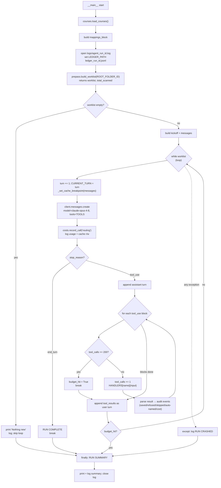

Note: the loop guard is literally `while worklist:` and `worklist` is never
mutated — iteration ends only via `break` (`end_turn` or budget) or an exception;
the empty-worklist case never enters the body. The 200-cap check happens *before*
each dispatch, so the run stops at exactly 200 real tool calls even within a
batched turn.

---

## 2. Pre-pass internal

`prepass.build_worklist` → `walk_tree` (recurse, md5 metadata only) → `diff_tree`
(pure per-file md5 decision). Absence from the worklist *is* the "unchanged"
signal.

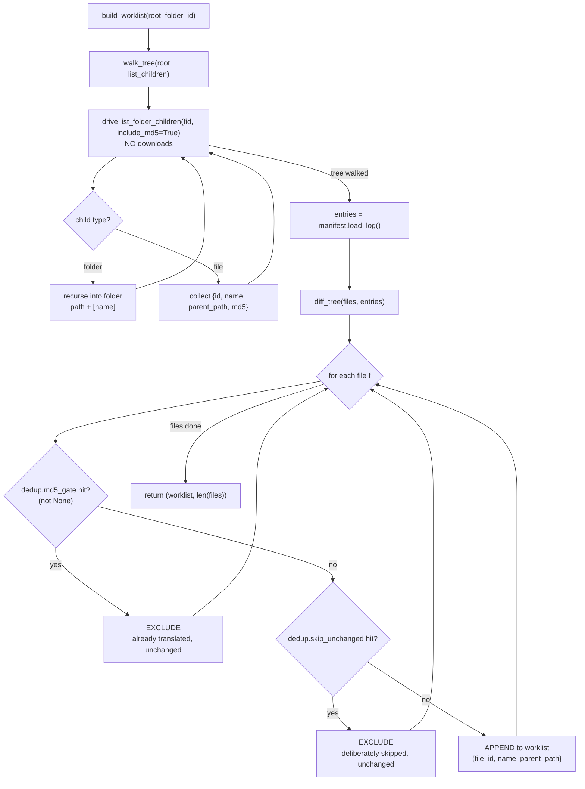

---

## 3. Dedup decision (`dedup.py`, single source)

The three pure verdict functions. `md5_gate` + `skip_unchanged` run pre-download
(in `diff_tree`); `hash_dedup` runs post-download (in `read_file_logic`).

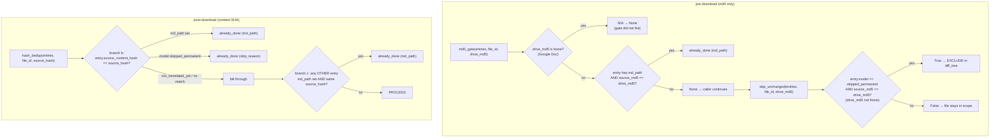

Note: `read_file_logic` calls only `md5_gate` then `hash_dedup`; it does **not**
call `skip_unchanged` (that one fires solely in the pre-pass `diff_tree`). The
diagram groups all three because `dedup.py` is the single decision source for both
sites.

---

## 4. Tool — `list_folder`

`handle_list_folder`: a thin pass-through to Drive; no status branches.

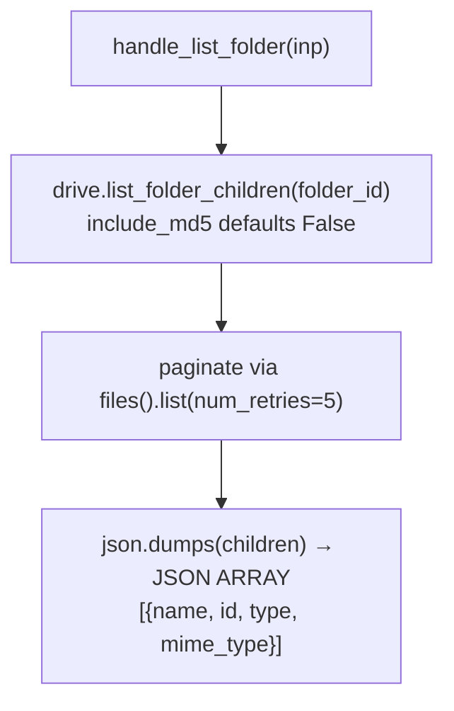

---

## 5. Tool — `read_file`

`handle_read_file` → `read_file_logic`: md5 gate → download+verify → hash → dedup
→ detector → cache writes → `ready`. Every failure returns `error`, never raises.

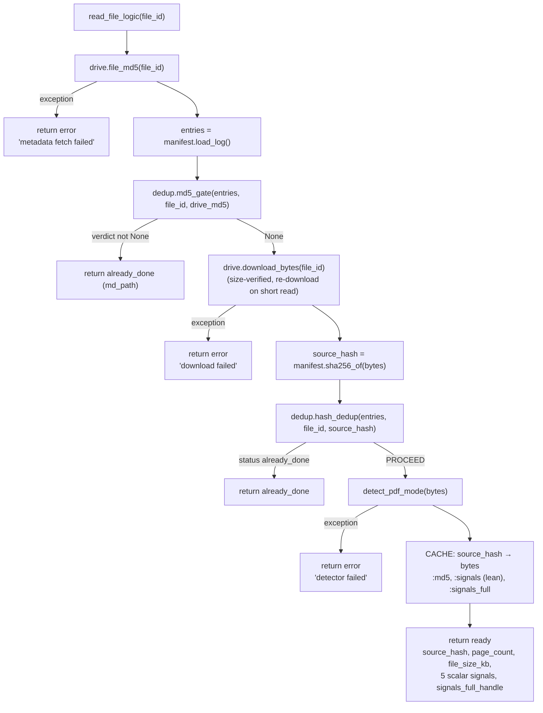

---

## 6. Tool — `translate_text_pdf`

`handle_translate_text` → `_translate_logic(engine.translate_text_pdf,
'translation_text')`. Two refusal paths (yield RuntimeError and `REFUSED:`
first-line) plus generic error.

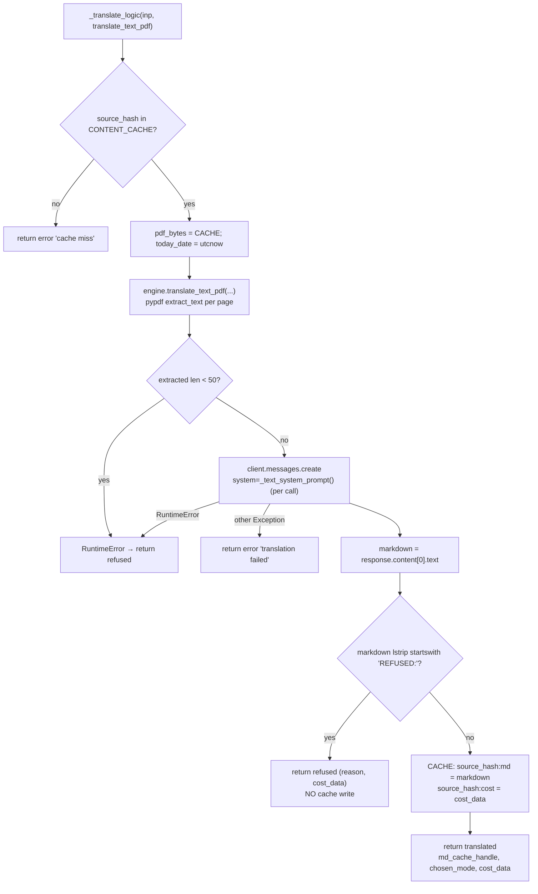

---

## 7. Tool — `translate_image_pdf`

`handle_translate_image` → `_translate_logic(engine.translate_image_pdf,
'translation_image')`. Same wrapper as text; the engine rasterises at 200 DPI and
sends vision blocks. No `&lt;50`-char gate (that is text-only).

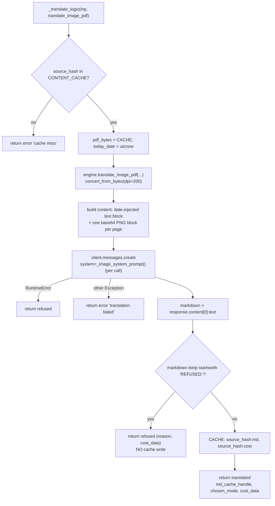

Note: in image mode the text-path RuntimeError (`<50` chars) cannot fire — that
guard lives only in `translate_text_pdf`. The `refused` branch via RuntimeError is
shown for parity with the shared wrapper, but in practice image-mode refusal
arrives through the `REFUSED:` first-line check.

---

## 8. Tool — `save_to_vault`

`handle_save_to_vault` reads markdown/cost/signals from cache, then
`engine.save_to_vault` writes the `.md` atomically *before* the manifest upsert.

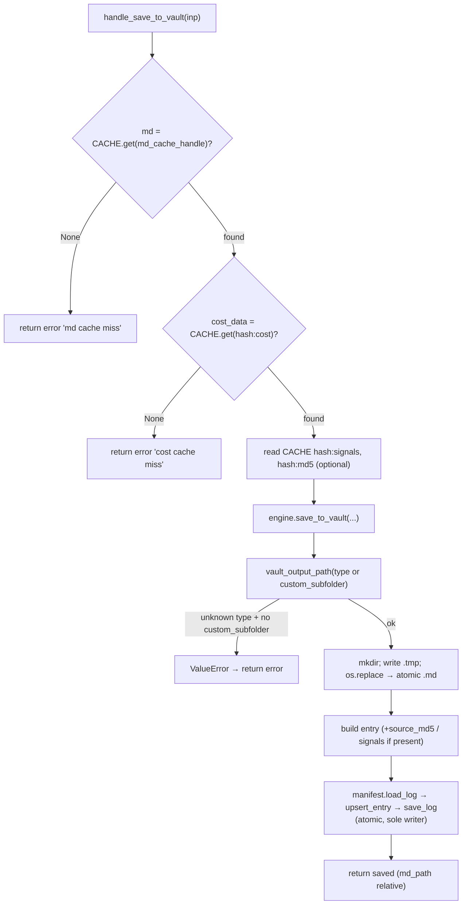

---

## 9. Tool — `update_mapping`

`handle_update_mapping`: persist an agent-assigned course name, logged loudly.

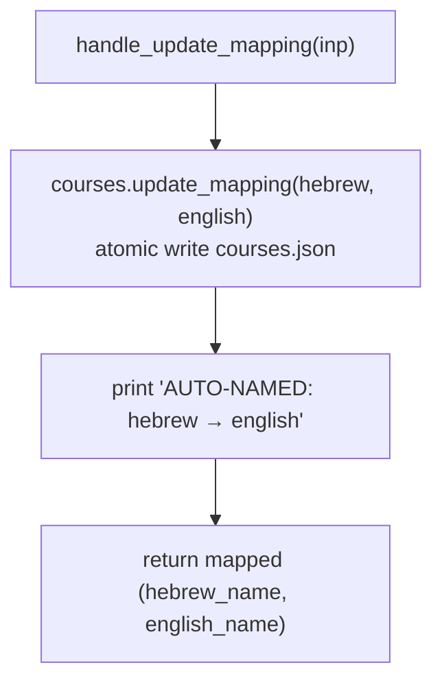

---

## 10. Tool — `skip_file`

`handle_skip_file`: write a `skipped_permanent` manifest entry; attach
`source_md5` only when the read_file cache has it.

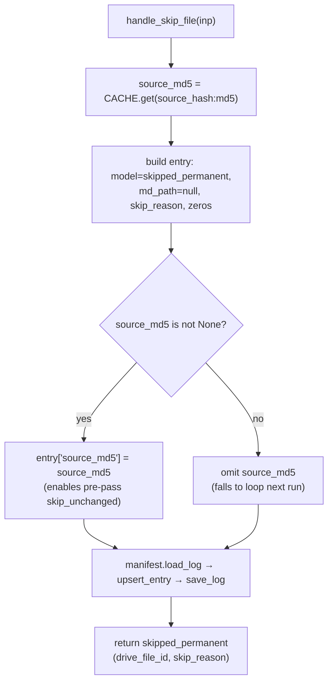

---

## 11. Tool — `fetch_signal_detail`

`handle_fetch_signal_detail`: return the offloaded verbose signals for a
read_file handle.

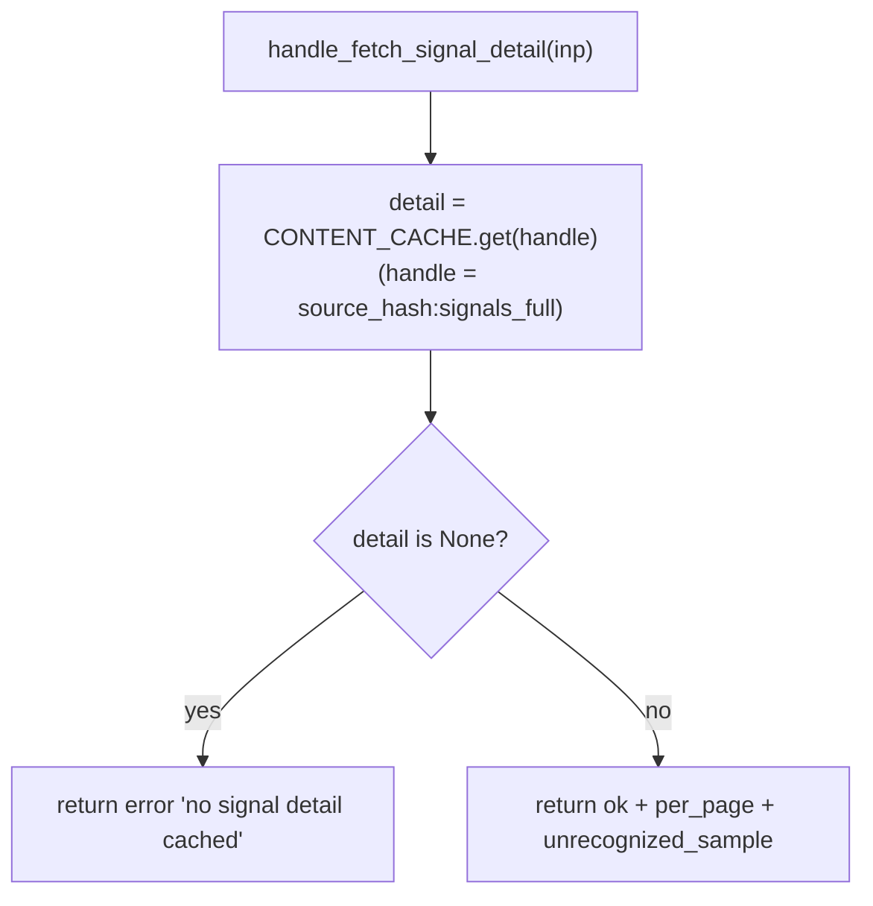
